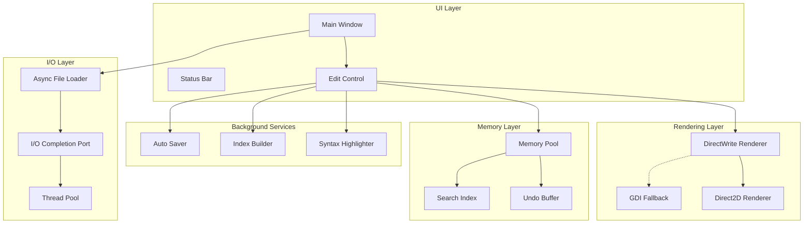
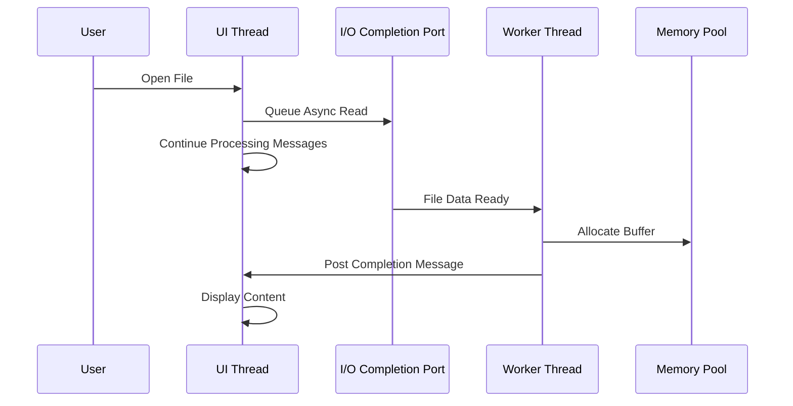

# Design Document: Advanced Performance Optimization

## Overview

Dokumen ini menjelaskan desain teknis untuk optimasi performa lanjutan XNote. Implementasi menggunakan teknologi Windows modern seperti IOCP, DirectWrite, Direct2D, dan memory pooling untuk mencapai performa maksimal.

### Tujuan Utama
1. File loading yang lebih cepat dengan asynchronous I/O
2. Text rendering smooth dengan hardware acceleration
3. Syntax highlighting yang tidak mengganggu typing
4. Memory management yang efisien
5. Pencarian cepat dengan background indexing
6. Scrolling smooth dengan hardware acceleration
7. Startup cepat dengan lazy initialization
8. Auto-save yang tidak mengganggu

## Architecture

### High-Level Architecture



### Component Interaction Flow



## Components and Interfaces

### 1. Asynchronous I/O Manager

```c
/* I/O Completion Port Manager */
typedef struct {
    HANDLE hIOCP;               /* I/O Completion Port handle */
    HANDLE hThreadPool[4];      /* Worker threads */
    volatile BOOL bShutdown;    /* Shutdown flag */
} IOCPManager;

/* Async file operation structure */
typedef struct {
    OVERLAPPED overlapped;      /* Must be first for IOCP */
    HANDLE hFile;               /* File handle */
    LPVOID pBuffer;             /* Data buffer */
    DWORD dwBufferSize;         /* Buffer size */
    DWORD dwBytesTransferred;   /* Bytes read/written */
    HWND hwndNotify;            /* Window to notify on completion */
    UINT uMsgComplete;          /* Message to post on completion */
    void* pUserData;            /* User context data */
} AsyncFileOp;

/* IOCP functions */
BOOL IOCP_Initialize(IOCPManager* pMgr);
void IOCP_Shutdown(IOCPManager* pMgr);
BOOL IOCP_QueueRead(IOCPManager* pMgr, AsyncFileOp* pOp);
BOOL IOCP_QueueWrite(IOCPManager* pMgr, AsyncFileOp* pOp);
DWORD WINAPI IOCP_WorkerThread(LPVOID lpParam);
```

### 2. DirectWrite Text Renderer

```c
/* DirectWrite renderer state */
typedef struct {
    ID2D1Factory* pD2DFactory;
    IDWriteFactory* pDWriteFactory;
    IDWriteTextFormat* pTextFormat;
    ID2D1HwndRenderTarget* pRenderTarget;
    ID2D1SolidColorBrush* pTextBrush;
    ID2D1SolidColorBrush* pBgBrush;
    BOOL bHardwareAccelerated;
} DWriteRenderer;

/* DirectWrite functions */
BOOL DWrite_Initialize(DWriteRenderer* pRenderer, HWND hwnd);
void DWrite_Shutdown(DWriteRenderer* pRenderer);
BOOL DWrite_SetFont(DWriteRenderer* pRenderer, const WCHAR* szFontName, float fSize);
void DWrite_RenderText(DWriteRenderer* pRenderer, const WCHAR* szText, RECT* pRect);
BOOL DWrite_IsAvailable(void);
```

### 3. Memory Pool Allocator

```c
/* Memory pool block */
typedef struct MemBlock {
    struct MemBlock* pNext;     /* Next free block */
    DWORD dwSize;               /* Block size */
    BYTE data[1];               /* Flexible array member */
} MemBlock;

/* Memory pool */
typedef struct {
    MemBlock* pFreeList;        /* Free block list */
    LPVOID pPoolBase;           /* Pool base address */
    DWORD dwPoolSize;           /* Total pool size */
    DWORD dwUsedSize;           /* Currently used size */
    DWORD dwMaxSize;            /* Maximum allowed size (500MB) */
    CRITICAL_SECTION cs;        /* Thread safety */
} MemoryPool;

/* Pool size constants */
#define MEMPOOL_MAX_SIZE        (500 * 1024 * 1024)  /* 500MB max */
#define MEMPOOL_INITIAL_SIZE    (64 * 1024 * 1024)   /* 64MB initial */
#define MEMPOOL_BLOCK_ALIGN     16                    /* 16-byte alignment */

/* Memory pool functions */
BOOL MemPool_Initialize(MemoryPool* pPool);
void MemPool_Shutdown(MemoryPool* pPool);
LPVOID MemPool_Alloc(MemoryPool* pPool, DWORD dwSize);
void MemPool_Free(MemoryPool* pPool, LPVOID pMem);
DWORD MemPool_GetUsage(MemoryPool* pPool);
BOOL MemPool_IsNearLimit(MemoryPool* pPool);
```

### 4. Background Search Indexer

```c
/* Search index entry */
typedef struct {
    DWORD dwLineNumber;         /* Line number */
    DWORD dwOffset;             /* Character offset in line */
    DWORD dwLength;             /* Match length */
} SearchMatch;

/* Search index */
typedef struct {
    WCHAR* pText;               /* Indexed text */
    DWORD dwTextLen;            /* Text length */
    DWORD* pLineOffsets;        /* Line start offsets */
    DWORD dwLineCount;          /* Number of lines */
    BOOL bIndexReady;           /* Index built flag */
    CRITICAL_SECTION cs;        /* Thread safety */
} SearchIndex;

/* Boyer-Moore search state */
typedef struct {
    int badChar[256];           /* Bad character table */
    int* goodSuffix;            /* Good suffix table */
    WCHAR* pPattern;            /* Search pattern */
    DWORD dwPatternLen;         /* Pattern length */
} BoyerMooreState;

/* Search functions */
BOOL SearchIndex_Initialize(SearchIndex* pIndex);
void SearchIndex_Shutdown(SearchIndex* pIndex);
BOOL SearchIndex_Build(SearchIndex* pIndex, const WCHAR* pText, DWORD dwLen);
BOOL SearchIndex_Update(SearchIndex* pIndex, DWORD dwStart, DWORD dwEnd, const WCHAR* pNewText);
SearchMatch* SearchIndex_Find(SearchIndex* pIndex, const WCHAR* pPattern, DWORD* pdwCount);
void BoyerMoore_Init(BoyerMooreState* pState, const WCHAR* pPattern);
DWORD BoyerMoore_Search(BoyerMooreState* pState, const WCHAR* pText, DWORD dwTextLen);
```

### 5. Incremental Syntax Highlighter

```c
/* Syntax highlight range */
typedef struct {
    DWORD dwStart;              /* Start offset */
    DWORD dwEnd;                /* End offset */
    COLORREF crColor;           /* Text color */
    DWORD dwStyle;              /* Font style (bold, italic) */
} HighlightRange;

/* Incremental highlighter state */
typedef struct {
    HighlightRange* pRanges;    /* Highlight ranges */
    DWORD dwRangeCount;         /* Number of ranges */
    DWORD dwRangeCapacity;      /* Allocated capacity */
    DWORD dwFirstDirtyLine;     /* First line needing update */
    DWORD dwLastDirtyLine;      /* Last line needing update */
    BOOL bFullRefreshNeeded;    /* Full refresh flag */
    HANDLE hWorkerThread;       /* Background worker thread */
    HANDLE hWorkEvent;          /* Work available event */
    volatile BOOL bShutdown;    /* Shutdown flag */
} IncrementalHighlighter;

/* Highlighter functions */
BOOL Highlighter_Initialize(IncrementalHighlighter* pH);
void Highlighter_Shutdown(IncrementalHighlighter* pH);
void Highlighter_MarkDirty(IncrementalHighlighter* pH, DWORD dwLine);
void Highlighter_MarkRangeDirty(IncrementalHighlighter* pH, DWORD dwStartLine, DWORD dwEndLine);
BOOL Highlighter_ProcessVisible(IncrementalHighlighter* pH, DWORD dwFirstVisible, DWORD dwLastVisible);
DWORD WINAPI Highlighter_WorkerThread(LPVOID lpParam);
```

### 6. Smooth Scroll Manager

```c
/* Scroll animation state */
typedef struct {
    int nTargetPos;             /* Target scroll position */
    int nCurrentPos;            /* Current scroll position */
    float fVelocity;            /* Current velocity */
    DWORD dwStartTime;          /* Animation start time */
    DWORD dwDuration;           /* Animation duration */
    BOOL bAnimating;            /* Animation in progress */
} ScrollAnimation;

/* Smooth scroll manager */
typedef struct {
    ScrollAnimation vertical;    /* Vertical scroll state */
    ScrollAnimation horizontal;  /* Horizontal scroll state */
    BOOL bHardwareAccelerated;  /* Using D2D */
    int nPredictedLines;        /* Pre-rendered lines */
} SmoothScrollManager;

/* Easing function type */
typedef float (*EasingFunc)(float t);

/* Scroll constants */
#define SCROLL_ANIMATION_MS     150     /* Animation duration */
#define SCROLL_PREDICT_LINES    10      /* Lines to pre-render */
#define SCROLL_FPS_TARGET       60      /* Target frame rate */

/* Smooth scroll functions */
BOOL SmoothScroll_Initialize(SmoothScrollManager* pMgr);
void SmoothScroll_Shutdown(SmoothScrollManager* pMgr);
void SmoothScroll_ScrollTo(SmoothScrollManager* pMgr, int nTargetY, BOOL bAnimate);
void SmoothScroll_Update(SmoothScrollManager* pMgr, DWORD dwDeltaTime);
float SmoothScroll_EaseOutCubic(float t);
```

### 7. Auto-Save Manager

```c
/* Auto-save state */
typedef struct {
    HANDLE hThread;             /* Background save thread */
    HANDLE hWakeEvent;          /* Wake event for save */
    HANDLE hStopEvent;          /* Stop event for shutdown */
    DWORD dwIntervalMs;         /* Save interval (60000ms) */
    DWORD dwDelayAfterTypeMs;   /* Delay after typing (3000ms) */
    DWORD dwLastKeystroke;      /* Last keystroke time */
    volatile BOOL bPendingSave; /* Save pending flag */
    volatile BOOL bSaving;      /* Currently saving flag */
    CRITICAL_SECTION cs;        /* Thread safety */
} AutoSaveManager;

/* Auto-save constants */
#define AUTOSAVE_INTERVAL_MS    60000   /* 60 seconds */
#define AUTOSAVE_DELAY_MS       3000    /* 3 seconds after typing */

/* Auto-save functions */
BOOL AutoSave_Initialize(AutoSaveManager* pMgr);
void AutoSave_Shutdown(AutoSaveManager* pMgr);
void AutoSave_OnKeystroke(AutoSaveManager* pMgr);
void AutoSave_TriggerNow(AutoSaveManager* pMgr);
DWORD WINAPI AutoSave_WorkerThread(LPVOID lpParam);
```

### 8. Performance Monitor

```c
/* Performance metrics */
typedef struct {
    DWORD dwFrameCount;         /* Frames rendered */
    DWORD dwLastFPSUpdate;      /* Last FPS calculation time */
    float fCurrentFPS;          /* Current FPS */
    DWORD dwMemoryUsage;        /* Current memory usage */
    DWORD dwPeakMemory;         /* Peak memory usage */
    BOOL bDebugMode;            /* Debug mode enabled */
    BOOL bShowFPS;              /* Show FPS in status bar */
    BOOL bShowMemory;           /* Show memory in status bar */
} PerfMonitor;

/* Performance thresholds */
#define PERF_SLOW_OP_MS         100     /* Slow operation threshold */
#define PERF_MEMORY_WARN_MB     400     /* Memory warning threshold */

/* Performance monitor functions */
void PerfMon_Initialize(PerfMonitor* pMon);
void PerfMon_BeginFrame(PerfMonitor* pMon);
void PerfMon_EndFrame(PerfMonitor* pMon);
void PerfMon_LogSlowOp(PerfMonitor* pMon, const char* szOpName, DWORD dwMs);
void PerfMon_UpdateMemory(PerfMonitor* pMon);
void PerfMon_GetStatusText(PerfMonitor* pMon, TCHAR* szBuffer, DWORD dwSize);
```

## Data Models

### Extended AppState

```c
/* Extended application state for performance features */
typedef struct {
    /* Existing fields... */
    
    /* Performance components */
    IOCPManager iocp;           /* Async I/O manager */
    MemoryPool memPool;         /* Memory pool */
    SearchIndex searchIndex;    /* Search index */
    AutoSaveManager autoSave;   /* Auto-save manager */
    PerfMonitor perfMon;        /* Performance monitor */
    SmoothScrollManager scroll; /* Smooth scroll manager */
    
    /* Rendering */
    DWriteRenderer* pDWrite;    /* DirectWrite renderer (NULL if unavailable) */
    BOOL bUseHardwareAccel;     /* Hardware acceleration enabled */
    
    /* Settings */
    BOOL bAutoSaveEnabled;      /* Auto-save enabled */
    BOOL bSmoothScrollEnabled;  /* Smooth scroll enabled */
    BOOL bDebugMode;            /* Debug mode enabled */
} AppStateEx;
```

### Extended TabState

```c
/* Extended tab state for performance features */
typedef struct {
    /* Existing fields... */
    
    /* Incremental highlighting */
    IncrementalHighlighter highlighter;
    
    /* Undo optimization */
    DWORD dwUndoMemoryUsage;    /* Memory used by undo buffer */
    DWORD dwUndoMaxMemory;      /* Max undo memory (10MB) */
} TabStateEx;
```

## Correctness Properties

*A property is a characteristic or behavior that should hold true across all valid executions of a system-essentially, a formal statement about what the system should do. Properties serve as the bridge between human-readable specifications and machine-verifiable correctness guarantees.*

### Property 1: Async I/O Responsiveness
*For any* file being loaded asynchronously, the UI thread SHALL process Windows messages within 50ms, and content SHALL be displayed within 50ms after data is available.
**Validates: Requirements 1.1, 1.2, 1.4**

### Property 2: Scroll Frame Rate
*For any* scroll operation on hardware with DirectWrite/Direct2D support, the frame rate SHALL be at least 60 FPS.
**Validates: Requirements 2.3**

### Property 3: Incremental Syntax Highlighting Performance
*For any* keystroke in a file with syntax highlighting enabled, the highlighting operation SHALL complete within 16ms and SHALL only process the changed line(s).
**Validates: Requirements 3.1, 3.2, 3.3, 3.4**

### Property 4: Memory Pool Bounds
*For any* state with multiple tabs open, the total memory usage for file content SHALL not exceed 500MB, and memory SHALL be returned to the pool when tabs are closed.
**Validates: Requirements 4.1, 4.2, 4.3**

### Property 5: Search Index Performance
*For any* file up to 10MB, search operations SHALL complete within 100ms, and the index SHALL be updated incrementally when the file is modified.
**Validates: Requirements 5.1, 5.2, 5.3**

### Property 6: Smooth Scroll Easing
*For any* mouse wheel scroll event, the scroll animation SHALL apply easing (ease-out-cubic) and pre-render content for smooth visual feedback.
**Validates: Requirements 6.2, 6.3**

### Property 7: Fast Startup
*For any* application launch, the main window SHALL be visible within 500ms, and non-essential components SHALL be initialized lazily after UI is ready.
**Validates: Requirements 7.1, 7.2, 7.3**

### Property 8: Undo Performance
*For any* undo operation, the operation SHALL complete within 100ms, and the undo buffer SHALL automatically remove oldest operations when memory limit is reached.
**Validates: Requirements 8.1, 8.2, 8.3, 8.4**

### Property 9: Background Auto-Save
*For any* modified file with auto-save enabled, the file SHALL be saved in background every 60 seconds, delayed by 3 seconds after the last keystroke, without blocking UI input.
**Validates: Requirements 9.1, 9.2, 9.4**

### Property 10: Performance Logging
*For any* operation taking more than 100ms, the operation SHALL be logged to debug log, and memory warnings SHALL be logged when usage exceeds threshold.
**Validates: Requirements 10.2, 10.3**

## Error Handling

### Error Categories

1. **DirectWrite/Direct2D Errors**
   - Factory creation failure
   - Render target creation failure
   - Device lost during rendering

2. **IOCP Errors**
   - Thread pool creation failure
   - Async operation failure
   - Completion port error

3. **Memory Pool Errors**
   - Pool exhaustion
   - Allocation failure
   - Fragmentation issues

4. **Auto-Save Errors**
   - File write failure
   - Disk full
   - Permission denied

### Error Handling Strategy

```c
/* Error codes */
typedef enum {
    PERFERR_SUCCESS = 0,
    PERFERR_DWRITE_INIT_FAILED,
    PERFERR_D2D_INIT_FAILED,
    PERFERR_IOCP_INIT_FAILED,
    PERFERR_MEMPOOL_EXHAUSTED,
    PERFERR_AUTOSAVE_FAILED,
    PERFERR_INDEX_BUILD_FAILED
} PerfErrorCode;

/* Fallback strategies */
void HandleDWriteError(HRESULT hr);     /* Fallback to GDI */
void HandleIOCPError(DWORD dwError);    /* Fallback to sync I/O */
void HandleMemPoolError(void);          /* Use system heap */
void HandleAutoSaveError(DWORD dwError); /* Show status bar notification */
```

### Recovery Strategies

| Error Type | Recovery Action |
|------------|-----------------|
| DirectWrite unavailable | Use GDI text rendering |
| Direct2D unavailable | Use GDI scrolling |
| IOCP failure | Fall back to synchronous I/O |
| Memory pool exhausted | Use system heap, show warning |
| Auto-save failure | Show non-blocking notification |

## Testing Strategy

### Dual Testing Approach

Testing akan menggunakan kombinasi unit tests dan property-based tests:

1. **Unit Tests**: Memverifikasi contoh spesifik dan edge cases
2. **Property-Based Tests**: Memverifikasi properti universal

### Property-Based Testing Framework

Menggunakan **theft** library untuk C dengan konfigurasi minimal **100 iterasi** per test.

### Test Categories

#### 1. Async I/O Tests (Property-Based)
```c
/* **Feature: advanced-performance, Property 1: Async I/O Responsiveness** */
static enum theft_trial_res prop_async_io_responsive(struct theft* t, void* arg) {
    DWORD dwFileSize = *(DWORD*)arg;
    DWORD dwStartTime = GetTickCount();
    
    // Start async load
    AsyncFileOp op = {0};
    IOCP_QueueRead(&g_IOCP, &op);
    
    // Verify UI remains responsive
    MSG msg;
    while (PeekMessage(&msg, NULL, 0, 0, PM_REMOVE)) {
        DWORD dwElapsed = GetTickCount() - dwStartTime;
        if (dwElapsed > 50) return THEFT_TRIAL_FAIL;
        TranslateMessage(&msg);
        DispatchMessage(&msg);
    }
    
    return THEFT_TRIAL_PASS;
}
```

#### 2. Memory Pool Tests (Property-Based)
```c
/* **Feature: advanced-performance, Property 4: Memory Pool Bounds** */
static enum theft_trial_res prop_mempool_bounds(struct theft* t, void* arg) {
    MemoryPool pool;
    MemPool_Initialize(&pool);
    
    // Allocate random sizes
    DWORD dwTotalAlloc = 0;
    for (int i = 0; i < 100; i++) {
        DWORD dwSize = rand() % (10 * 1024 * 1024); // Up to 10MB
        LPVOID p = MemPool_Alloc(&pool, dwSize);
        if (p) dwTotalAlloc += dwSize;
    }
    
    // Verify bounds
    if (MemPool_GetUsage(&pool) > MEMPOOL_MAX_SIZE) {
        MemPool_Shutdown(&pool);
        return THEFT_TRIAL_FAIL;
    }
    
    MemPool_Shutdown(&pool);
    return THEFT_TRIAL_PASS;
}
```

#### 3. Search Performance Tests (Property-Based)
```c
/* **Feature: advanced-performance, Property 5: Search Index Performance** */
static enum theft_trial_res prop_search_performance(struct theft* t, void* arg) {
    SearchTestData* pData = (SearchTestData*)arg;
    
    // Build index
    SearchIndex index;
    SearchIndex_Initialize(&index);
    SearchIndex_Build(&index, pData->pText, pData->dwTextLen);
    
    // Search and measure time
    DWORD dwStart = GetTickCount();
    DWORD dwCount;
    SearchMatch* pMatches = SearchIndex_Find(&index, pData->pPattern, &dwCount);
    DWORD dwElapsed = GetTickCount() - dwStart;
    
    SearchIndex_Shutdown(&index);
    
    // Verify performance (100ms for files up to 10MB)
    if (pData->dwTextLen <= 10 * 1024 * 1024 && dwElapsed > 100) {
        return THEFT_TRIAL_FAIL;
    }
    
    return THEFT_TRIAL_PASS;
}
```

#### 4. Unit Tests

```c
/* Unit test: DirectWrite fallback */
void test_dwrite_fallback(void) {
    DWriteRenderer renderer = {0};
    
    // Simulate DirectWrite unavailable
    BOOL bResult = DWrite_Initialize(&renderer, NULL);
    
    // Should gracefully fail and allow GDI fallback
    assert(bResult == FALSE || renderer.pD2DFactory != NULL);
}

/* Unit test: Memory pool allocation */
void test_mempool_alloc(void) {
    MemoryPool pool;
    MemPool_Initialize(&pool);
    
    // Allocate and free
    LPVOID p1 = MemPool_Alloc(&pool, 1024);
    assert(p1 != NULL);
    
    MemPool_Free(&pool, p1);
    
    // Verify memory returned to pool
    LPVOID p2 = MemPool_Alloc(&pool, 1024);
    assert(p2 == p1); // Should reuse same block
    
    MemPool_Shutdown(&pool);
}

/* Unit test: Auto-save delay */
void test_autosave_delay(void) {
    AutoSaveManager mgr;
    AutoSave_Initialize(&mgr);
    
    // Simulate keystroke
    AutoSave_OnKeystroke(&mgr);
    
    // Verify save is delayed
    assert(mgr.bPendingSave == FALSE);
    
    // Wait for delay
    Sleep(AUTOSAVE_DELAY_MS + 100);
    
    // Now save should be pending
    assert(mgr.bPendingSave == TRUE);
    
    AutoSave_Shutdown(&mgr);
}
```

### Test Annotation Format

Setiap property-based test HARUS di-tag dengan format:
```
**Feature: advanced-performance, Property {number}: {property_text}**
```

