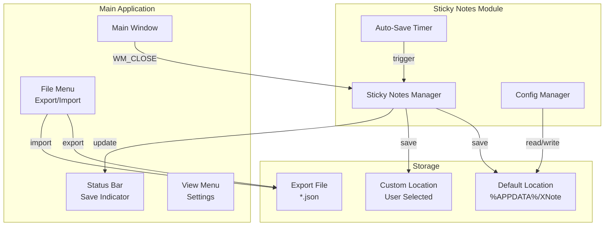

# Design Document: Sticky Notes Persistence

## Overview

Fitur ini memperbaiki dan memperluas sistem penyimpanan sticky notes dengan memastikan data tersimpan dengan benar saat aplikasi ditutup, menambahkan fitur export/import, dan memungkinkan pengguna memilih lokasi penyimpanan sendiri.

## Architecture



## Components and Interfaces

### 1. Enhanced Storage Functions

```c
/* Get/Set custom storage path */
BOOL StickyNotes_GetStoragePath(TCHAR* szPath, DWORD nSize);
BOOL StickyNotes_SetStoragePath(const TCHAR* szPath);
BOOL StickyNotes_ResetStoragePath(void);

/* Export/Import functions */
BOOL StickyNotes_Export(const TCHAR* szFilePath);
int StickyNotes_Import(const TCHAR* szFilePath, BOOL bMerge);

/* Save with status callback */
typedef void (*SaveStatusCallback)(BOOL bSaving, BOOL bSuccess);
void StickyNotes_SetSaveCallback(SaveStatusCallback callback);

/* Force save (called on app close) */
void StickyNotes_ForceSave(void);
```

### 2. Config File Structure

Lokasi config: `%APPDATA%\XNote\sticky_notes_config.json`

```json
{
  "storagePath": "C:\\Users\\User\\Documents\\MyNotes",
  "autoSaveInterval": 5000,
  "lastSaveTime": "2024-01-15T10:30:00"
}
```

### 3. Menu Structure

```
File Menu:
├── ...existing items...
├── ─────────────────────
├── Export Sticky Notes...
└── Import Sticky Notes...

View Menu:
├── ...existing items...
├── ─────────────────────
└── Sticky Notes Settings...
```

### 4. Settings Dialog Layout

```
┌─────────────────────────────────────────────────────┐
│ Sticky Notes Settings                          [X]  │
├─────────────────────────────────────────────────────┤
│                                                     │
│ Storage Location:                                   │
│ ┌─────────────────────────────────────────┐ [Browse]│
│ │ C:\Users\User\AppData\Roaming\XNote     │         │
│ └─────────────────────────────────────────┘         │
│                                                     │
│ [Reset to Default]                                  │
│                                                     │
│ Auto-save interval: [5] seconds                     │
│                                                     │
│                              [OK]    [Cancel]       │
└─────────────────────────────────────────────────────┘
```

## Data Models

### Export/Import JSON Format

```json
{
  "version": 1,
  "exportDate": "2024-01-15T10:30:00",
  "noteCount": 3,
  "stickyNotes": [
    {
      "id": 1,
      "x": 100,
      "y": 100,
      "width": 200,
      "height": 150,
      "color": 0,
      "visible": true,
      "content": "Meeting notes..."
    }
  ]
}
```

### Resource IDs

```c
/* Menu IDs */
#define IDM_FILE_EXPORT_STICKYNOTES  40100
#define IDM_FILE_IMPORT_STICKYNOTES  40101
#define IDM_VIEW_STICKYNOTES_SETTINGS 40102

/* Dialog IDs */
#define IDD_STICKYNOTES_SETTINGS     210
#define IDC_STORAGE_PATH             211
#define IDC_BTN_BROWSE               212
#define IDC_BTN_RESET                213
#define IDC_AUTOSAVE_INTERVAL        214
```

## Correctness Properties

*A property is a characteristic or behavior that should hold true across all valid executions of a system-essentially, a formal statement about what the system should do. Properties serve as the bridge between human-readable specifications and machine-verifiable correctness guarantees.*

### Property 1: Save-Load Round Trip
*For any* set of sticky notes with any content, position, size, color, and visibility state, saving then loading should produce an identical set of notes.
**Validates: Requirements 1.1, 1.2**

### Property 2: Export-Import Round Trip
*For any* set of sticky notes, exporting to a file then importing with "Replace" mode should produce an identical set of notes.
**Validates: Requirements 2.2, 3.4**

### Property 3: Import Merge Preserves All Notes
*For any* existing set of notes and any imported set of notes, after merge import, the total count should equal original count plus imported count, and all notes from both sets should be present.
**Validates: Requirements 3.3**

### Property 4: Import Replace Removes Old Notes
*For any* existing set of notes and any imported set of notes, after replace import, only the imported notes should exist.
**Validates: Requirements 3.4**

### Property 5: Storage Path Change Moves Data
*For any* storage path change, the sticky notes file should exist in the new location and the data should be identical to before the move.
**Validates: Requirements 4.4**

### Property 6: Content Change Sets Modified Flag
*For any* sticky note, changing its content should set bModified to TRUE.
**Validates: Requirements 1.3**

## Error Handling

| Error Condition | Handling Strategy |
|-----------------|-------------------|
| Storage path not writable | Show error, keep using previous path |
| Export file write failure | Show error message, return FALSE |
| Import file not found | Show error message, return -1 |
| Import file invalid JSON | Show error message, return -1 |
| Move to new location fails | Show error, keep using previous path |

## Testing Strategy

### Unit Testing
- Test save/load functions
- Test export/import functions
- Test path validation

### Property-Based Testing

Library: Manual implementation dengan random input generation.

Format tag untuk property tests:
```c
/* **Feature: sticky-notes-persistence, Property 1: Save-Load Round Trip** */
```

Setiap property test akan:
1. Generate random note properties
2. Perform operation (save, load, export, import)
3. Verify invariants hold
4. Run minimum 100 iterations

### Integration Testing
- Test menu integration
- Test settings dialog
- Test status bar updates
- Test persistence across app restart
