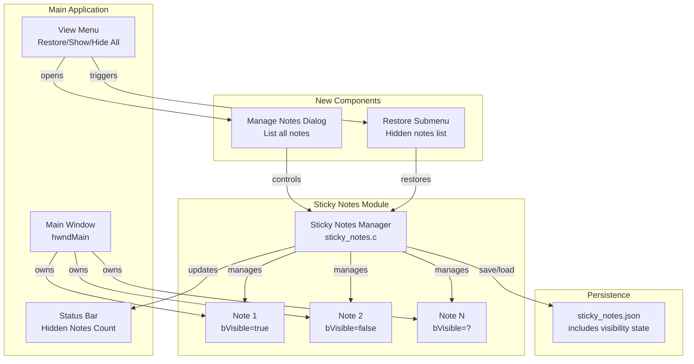

# Design Document: Restore Closed Sticky Notes

## Overview

Fitur ini memperluas sistem Sticky Notes yang sudah ada dengan menambahkan kemampuan untuk menyembunyikan (hide) sticky notes tanpa menghapusnya, dan menampilkannya kembali (restore) kapan saja. Fitur ini juga menambahkan dialog untuk mengelola semua sticky notes dan indikator di status bar untuk menunjukkan jumlah notes yang tersembunyi.

## Architecture



## Components and Interfaces

### 1. Modified StickyNote Structure

Struktur yang sudah ada sudah memiliki field `bVisible`, hanya perlu digunakan dengan benar:

```c
typedef struct {
    HWND hwndNote;           /* Window handle for the sticky note */
    HWND hwndEdit;           /* Edit control inside the note */
    int nNoteId;             /* Unique note ID (1-based) */
    int nPosX;               /* X position */
    int nPosY;               /* Y position */
    int nWidth;              /* Width */
    int nHeight;             /* Height */
    StickyNoteColor color;   /* Background color */
    TCHAR szContent[4096];   /* Note content */
    BOOL bModified;          /* Modified flag for auto-save */
    BOOL bVisible;           /* Visibility state - TRUE=shown, FALSE=hidden */
} StickyNote;
```

### 2. New Public Interface Functions

```c
/* Hide a sticky note (keep in storage, just hide window) */
void StickyNotes_Hide(int nIndex);

/* Restore a hidden sticky note */
void StickyNotes_Restore(int nIndex);

/* Toggle visibility of a sticky note */
void StickyNotes_ToggleVisibility(int nIndex);

/* Get count of hidden notes */
int StickyNotes_GetHiddenCount(void);

/* Get list of hidden note indices */
int StickyNotes_GetHiddenNotes(int* pIndices, int nMaxCount);

/* Get list of visible note indices */
int StickyNotes_GetVisibleNotes(int* pIndices, int nMaxCount);

/* Show manage notes dialog */
void StickyNotes_ShowManageDialog(HWND hwndParent);

/* Update status bar with hidden notes count */
void StickyNotes_UpdateStatusBar(HWND hwndStatusBar);

/* Build restore submenu with hidden notes */
void StickyNotes_BuildRestoreMenu(HMENU hMenu);
```

### 3. Menu Structure

```
View Menu:
├── New Sticky Note          Ctrl+Shift+N
├── ─────────────────────
├── Manage Sticky Notes...   Ctrl+Shift+M
├── Restore Sticky Note  →   [Submenu with hidden notes]
├── ─────────────────────
├── Show All Sticky Notes
└── Hide All Sticky Notes
```

### 4. Manage Notes Dialog Layout

```
┌─────────────────────────────────────────────────────┐
│ Manage Sticky Notes                            [X]  │
├─────────────────────────────────────────────────────┤
│ ┌─────────────────────────────────────────────────┐ │
│ │ ID │ Preview                    │ Color │ Status│ │
│ ├────┼────────────────────────────┼───────┼───────┤ │
│ │ 1  │ Meeting notes for today... │ 🟡    │ Shown │ │
│ │ 2  │ TODO: Fix bug #123...      │ 🩷    │ Hidden│ │
│ │ 3  │ Remember to call...        │ 🔵    │ Shown │ │
│ └─────────────────────────────────────────────────┘ │
│                                                     │
│ [Show/Hide]  [Delete]  [New Note]         [Close]   │
└─────────────────────────────────────────────────────┘
```

## Data Models

### JSON Persistence Format (unchanged)

Format JSON yang sudah ada sudah mendukung field `visible`:

```json
{
  "nextNoteId": 4,
  "stickyNotes": [
    {
      "id": 1,
      "x": 100,
      "y": 100,
      "width": 200,
      "height": 150,
      "color": 0,
      "visible": true,
      "content": "Meeting notes..."
    },
    {
      "id": 2,
      "x": 150,
      "y": 150,
      "width": 200,
      "height": 150,
      "color": 1,
      "visible": false,
      "content": "TODO: Fix bug..."
    }
  ]
}
```

### Resource IDs

```c
/* Menu IDs */
#define IDM_VIEW_MANAGE_STICKYNOTES  40080
#define IDM_VIEW_RESTORE_STICKYNOTE  40081
#define IDM_VIEW_SHOWALL_STICKYNOTES 40082
#define IDM_VIEW_HIDEALL_STICKYNOTES 40083

/* Restore submenu base ID (40090-40099 for up to 10 notes) */
#define IDM_RESTORE_STICKYNOTE_BASE  40090

/* Dialog IDs */
#define IDD_MANAGE_STICKYNOTES       200
#define IDC_STICKYNOTES_LIST         201
#define IDC_BTN_SHOWHIDE             202
#define IDC_BTN_DELETE               203
#define IDC_BTN_NEWNOTE              204
```

## Correctness Properties

*A property is a characteristic or behavior that should hold true across all valid executions of a system-essentially, a formal statement about what the system should do. Properties serve as the bridge between human-readable specifications and machine-verifiable correctness guarantees.*

### Property 1: Hide preserves note data and sets visibility to false
*For any* visible sticky note with any content, position, size, and color, calling StickyNotes_Hide should set bVisible to FALSE, hide the window, but preserve all other properties (content, position, size, color) unchanged.
**Validates: Requirements 1.1, 1.2, 1.3**

### Property 2: Restore sets visibility to true and shows window at saved position
*For any* hidden sticky note, calling StickyNotes_Restore should set bVisible to TRUE and show the window at the same position it was hidden at.
**Validates: Requirements 2.2, 2.3**

### Property 3: Hide then Restore is identity (round-trip)
*For any* visible sticky note, hiding then restoring should result in the note being visible with identical content, position, size, and color as before.
**Validates: Requirements 1.2, 2.2**

### Property 4: Hidden count accuracy
*For any* set of sticky notes, StickyNotes_GetHiddenCount should return the exact number of notes where bVisible is FALSE.
**Validates: Requirements 4.1**

### Property 5: Toggle visibility inverts state
*For any* sticky note, calling StickyNotes_ToggleVisibility should flip bVisible from TRUE to FALSE or from FALSE to TRUE.
**Validates: Requirements 3.4**

### Property 6: Hide All sets all notes to hidden
*For any* set of sticky notes with at least one visible note, calling StickyNotes_HideAll should set bVisible to FALSE for all notes.
**Validates: Requirements 5.1**

### Property 7: Show All sets all notes to visible
*For any* set of sticky notes with at least one hidden note, calling StickyNotes_ShowAll should set bVisible to TRUE for all notes.
**Validates: Requirements 5.2**

### Property 8: Delete permanently removes note
*For any* sticky note (visible or hidden), calling StickyNotes_Delete should remove the note from storage and decrease the total note count by 1.
**Validates: Requirements 1.4, 3.5**

## Error Handling

| Error Condition | Handling Strategy |
|-----------------|-------------------|
| Invalid note index | Return early, no operation |
| No hidden notes for restore menu | Disable menu item |
| Dialog creation failure | Show error message, return |
| Note already in target visibility state | No-op, return success |

## Testing Strategy

### Unit Testing
- Test hide/restore individual notes
- Test toggle visibility
- Test hidden count calculation
- Test show all/hide all operations

### Property-Based Testing

Library: Manual implementation dengan random input generation (sesuai dengan existing codebase).

Format tag untuk property tests:
```c
/* **Feature: sticky-notes-restore, Property 1: Hide preserves note data and sets visibility to false** */
```

Setiap property test akan:
1. Generate random note properties (content, position, size, color)
2. Perform operation (hide, restore, toggle, etc.)
3. Verify invariants hold
4. Run minimum 100 iterations

### Integration Testing
- Test menu integration
- Test dialog functionality
- Test status bar updates
- Test persistence of visibility state across app restart

