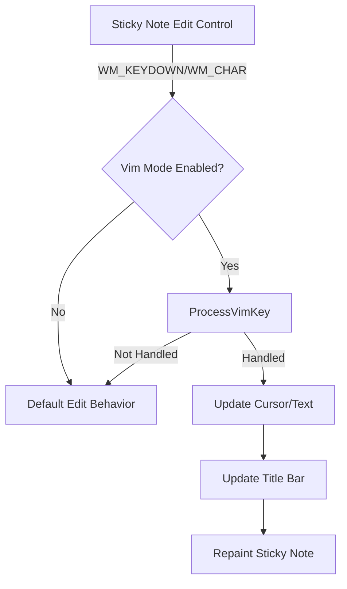

# Design Document: Vim Mode Integration for Sticky Notes

## Overview

Fitur ini mengintegrasikan Vim mode yang sudah ada ke sticky notes dengan cara memanfaatkan fungsi `ProcessVimKey` yang sudah ada. Pendekatan ini memastikan konsistensi perilaku dan meminimalkan duplikasi kode.

## Architecture



## Components and Interfaces

### 1. Sticky Note Window Procedure Enhancement

Modifikasi `StickyNoteWndProc` untuk menangkap keyboard input dan meneruskannya ke `ProcessVimKey`:

```c
// Di WM_COMMAND handler untuk edit control
case WM_COMMAND:
    if (HIWORD(wParam) == EN_SETFOCUS) {
        // Edit control mendapat focus - siap untuk Vim input
    }
    break;
```

### 2. Subclass Edit Control

Subclass edit control di sticky note untuk intercept keyboard messages sebelum diproses:

```c
// Subclass procedure untuk edit control
LRESULT CALLBACK StickyEditSubclassProc(HWND hwnd, UINT msg, 
    WPARAM wParam, LPARAM lParam, UINT_PTR uIdSubclass, DWORD_PTR dwRefData);
```

### 3. Title Bar Update

Modifikasi fungsi paint untuk menampilkan mode Vim di title bar:

```c
// Format title dengan mode indicator
if (IsVimModeEnabled()) {
    wsprintf(szTitle, TEXT("📝 Note %d [%s]"), pNote->nNoteId, GetVimModeString());
} else {
    wsprintf(szTitle, TEXT("📝 Note %d"), pNote->nNoteId);
}
```

## Data Models

Tidak ada perubahan struktur data yang diperlukan. Fitur ini menggunakan:

- `g_VimState` - Global Vim state yang sudah ada
- `StickyNote` - Struktur sticky note yang sudah ada

## Correctness Properties

*A property is a characteristic or behavior that should hold true across all valid executions of a system-essentially, a formal statement about what the system should do. Properties serve as the bridge between human-readable specifications and machine-verifiable correctness guarantees.*

### Property 1: Vim Key Routing Consistency

*For any* keyboard input in a sticky note when Vim mode is enabled, calling ProcessVimKey with the sticky note's edit control handle SHALL produce the same behavior as calling it with the main editor handle.

**Validates: Requirements 1.1**

### Property 2: Vim Disabled Passthrough

*For any* keyboard input in a sticky note when Vim mode is disabled, the input SHALL be passed directly to the edit control without modification by ProcessVimKey.

**Validates: Requirements 1.2**

## Error Handling

1. **Null Edit Control**: Jika `hwndEdit` adalah NULL, skip Vim processing dan gunakan default behavior
2. **Invalid Note Index**: Validasi index sebelum mengakses note data
3. **Focus Loss**: Saat sticky note kehilangan focus, pastikan state tersimpan dengan benar

## Testing Strategy

### Unit Tests

- Test bahwa `IsVimModeEnabled()` mengembalikan nilai yang benar
- Test bahwa `GetVimModeString()` mengembalikan string mode yang valid

### Property-Based Tests

Menggunakan framework testing yang tersedia di project (jika ada). Karena ini adalah aplikasi C Windows native, testing akan fokus pada:

1. **Manual Integration Testing**: Verifikasi bahwa Vim commands bekerja sama di sticky notes dan main editor
2. **Automated UI Testing** (jika tersedia): Simulate key presses dan verify cursor positions

### Integration Tests

- Buka sticky note, enable Vim mode, test navigasi (h, j, k, l)
- Test mode transitions (i, Escape, v)
- Test editing commands (x, dd, yy, p)
- Verify title bar menampilkan mode yang benar
