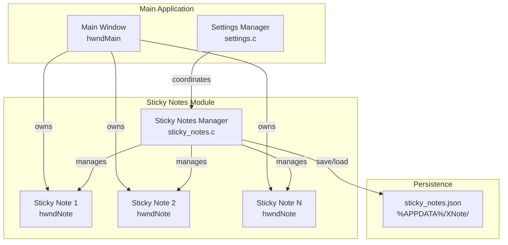

# Design Document: Sticky Notes

## Overview

Fitur Sticky Notes menambahkan kemampuan untuk membuat catatan kecil mengambang (floating notes) di atas jendela utama XNote. Implementasi menggunakan Win32 API untuk membuat child windows yang owned oleh main window, dengan persistensi data menggunakan format JSON yang sudah ada di settings.c.

## Architecture



## Components and Interfaces

### 1. StickyNote Structure

```c
#define MAX_STICKY_NOTES 10
#define STICKY_NOTE_MIN_WIDTH 100
#define STICKY_NOTE_MIN_HEIGHT 80
#define STICKY_NOTE_DEFAULT_WIDTH 200
#define STICKY_NOTE_DEFAULT_HEIGHT 150
#define STICKY_NOTE_OFFSET 30

typedef enum {
    STICKY_COLOR_YELLOW = 0,
    STICKY_COLOR_PINK,
    STICKY_COLOR_BLUE,
    STICKY_COLOR_GREEN,
    STICKY_COLOR_ORANGE,
    STICKY_COLOR_PURPLE,
    STICKY_COLOR_COUNT
} StickyNoteColor;

typedef struct {
    HWND hwndNote;           /* Window handle for the sticky note */
    HWND hwndEdit;           /* Edit control inside the note */
    int nNoteId;             /* Unique note ID (1-based) */
    int nPosX;               /* X position */
    int nPosY;               /* Y position */
    int nWidth;              /* Width */
    int nHeight;             /* Height */
    StickyNoteColor color;   /* Background color */
    TCHAR szContent[4096];   /* Note content */
    BOOL bModified;          /* Modified flag for auto-save */
    BOOL bVisible;           /* Visibility state */
} StickyNote;

typedef struct {
    StickyNote notes[MAX_STICKY_NOTES];
    int nNoteCount;
    int nNextNoteId;         /* Next available note ID */
    HWND hwndParent;         /* Parent window (main XNote window) */
    HINSTANCE hInstance;
} StickyNotesManager;
```

### 2. Public Interface (sticky_notes.h)

```c
/* Initialization and cleanup */
void StickyNotes_Init(HWND hwndParent, HINSTANCE hInstance);
void StickyNotes_Cleanup(void);

/* Note management */
BOOL StickyNotes_Create(void);
void StickyNotes_Close(int nIndex);
void StickyNotes_CloseAll(void);
int StickyNotes_GetCount(void);

/* Note properties */
void StickyNotes_SetColor(int nIndex, StickyNoteColor color);
StickyNoteColor StickyNotes_GetColor(int nIndex);
void StickyNotes_SetContent(int nIndex, const TCHAR* szContent);
const TCHAR* StickyNotes_GetContent(int nIndex);

/* Visibility control */
void StickyNotes_ShowAll(void);
void StickyNotes_HideAll(void);

/* Persistence */
void StickyNotes_Save(void);
void StickyNotes_Load(void);

/* Window procedure */
LRESULT CALLBACK StickyNoteWndProc(HWND hwnd, UINT msg, WPARAM wParam, LPARAM lParam);
```

### 3. Color Definitions

```c
static const COLORREF g_StickyColors[STICKY_COLOR_COUNT] = {
    RGB(255, 255, 200),  /* Yellow */
    RGB(255, 200, 200),  /* Pink */
    RGB(200, 220, 255),  /* Blue */
    RGB(200, 255, 200),  /* Green */
    RGB(255, 220, 180),  /* Orange */
    RGB(230, 200, 255)   /* Purple */
};
```

## Data Models

### JSON Persistence Format

```json
{
  "stickyNotes": [
    {
      "id": 1,
      "x": 100,
      "y": 100,
      "width": 200,
      "height": 150,
      "color": 0,
      "content": "Note content here",
      "visible": true
    }
  ],
  "nextNoteId": 2
}
```

File disimpan di: `%APPDATA%\XNote\sticky_notes.json`

## Correctness Properties

*A property is a characteristic or behavior that should hold true across all valid executions of a system-essentially, a formal statement about what the system should do. Properties serve as the bridge between human-readable specifications and machine-verifiable correctness guarantees.*

### Property 1: Note creation produces valid window with correct dimensions
*For any* call to StickyNotes_Create(), if the note count is below maximum, the function should return TRUE and the new note should have dimensions equal to STICKY_NOTE_DEFAULT_WIDTH x STICKY_NOTE_DEFAULT_HEIGHT.
**Validates: Requirements 1.1**

### Property 2: Note positioning offset
*For any* sequence of note creations, each new note should be positioned at an offset of STICKY_NOTE_OFFSET pixels from the previous note's position.
**Validates: Requirements 1.2**

### Property 3: Minimum size constraint enforcement
*For any* resize operation that attempts to set dimensions below STICKY_NOTE_MIN_WIDTH or STICKY_NOTE_MIN_HEIGHT, the resulting dimensions should be clamped to the minimum values.
**Validates: Requirements 3.3**

### Property 4: Color change updates note state
*For any* sticky note and any valid color value, calling StickyNotes_SetColor should update the note's color property to the specified value.
**Validates: Requirements 4.2, 4.4**

### Property 5: Close operation removes note
*For any* sticky note, calling StickyNotes_Close should decrease the note count by 1 and remove the note from the notes array.
**Validates: Requirements 5.1, 5.2**

### Property 6: Persistence round-trip
*For any* set of sticky notes with valid content, positions, sizes, and colors, saving then loading should restore equivalent note data.
**Validates: Requirements 6.1, 6.2**

### Property 7: Visibility follows parent window
*For any* set of sticky notes, when the parent window is minimized then restored, all notes that were visible before minimize should be visible after restore.
**Validates: Requirements 7.2, 7.3**

### Property 8: Unique sequential note IDs
*For any* set of created sticky notes, each note should have a unique ID and the IDs should be assigned sequentially.
**Validates: Requirements 8.1, 8.3**

## Error Handling

| Error Condition | Handling Strategy |
|-----------------|-------------------|
| Maximum notes reached | Display error message, return FALSE from Create |
| Invalid note index | Return early, no operation |
| JSON parse failure | Start with empty notes, create new file |
| File write failure | Log error, continue operation |
| Window creation failure | Return FALSE, clean up partial state |
| Memory allocation failure | Return FALSE, show error dialog |

## Testing Strategy

### Unit Testing
- Test note creation with valid and invalid states
- Test color change functionality
- Test minimum size constraint enforcement
- Test note ID assignment

### Property-Based Testing

Library: **theft** (C property-based testing library) atau manual implementation dengan random input generation.

Karena ini adalah aplikasi Win32 C murni, property-based testing akan diimplementasikan dengan:
1. Random input generators untuk note properties
2. Test harness yang menjalankan operasi dan memverifikasi invariants
3. Minimal 100 iterasi per property test

Format tag untuk property tests:
```c
/* **Feature: sticky-notes, Property 1: Note creation produces valid window with correct dimensions** */
```

### Integration Testing
- Test sticky notes dengan main window lifecycle
- Test persistence across application restart
- Test menu integration dan keyboard shortcuts
